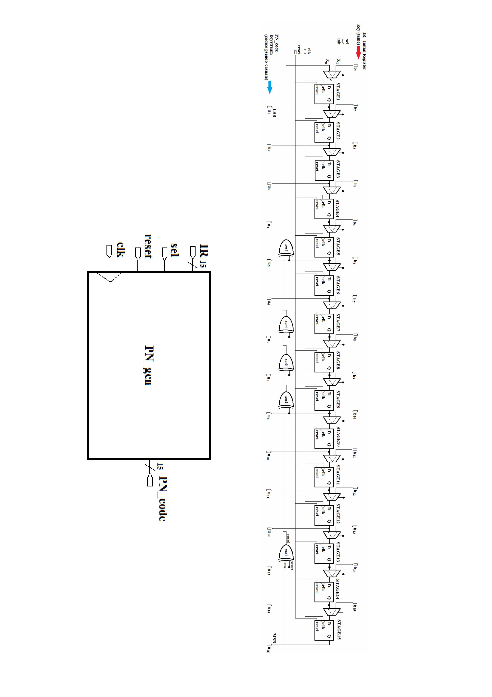

# 🔁 VHDL LFSR 15-bit — Pseudo-random Number Generator

> **University project** — Structural VHDL implementation of a Pseudo-random Number (PN) code generator based on a 15-stage **Linear Feedback Shift Register (LFSR)**.

<div align="center">


</div>

---

## Table of Contents

1. [Theory — LFSR and PN Sequences](#-theory--lfsr-and-pn-sequences)
2. [Architecture](#-architecture)
3. [File Structure](#-file-structure)
4. [Simulation — ModelSim](#-simulation--modelsim)
5. [Synthesis — Vivado](#-synthesis--vivado)
6. [FPGA Utilization Results](#-fpga-utilization-results)
7. [How to Run](#-how-to-run)
8. [References](#-references)

---

## 📐 Theory — LFSR and PN Sequences

A **Linear Feedback Shift Register (LFSR)** is a shift register whose input bit is computed as a linear (XOR) function of selected bits called *taps*. When the feedback polynomial is *primitive*, the LFSR produces a **maximum-length sequence (m-sequence)** of period:

$$L = 2^N - 1$$

where $N$ is the number of stages.

### Primitive polynomial used

For $N = 15$ stages, the implemented characteristic polynomial is:

$$f(x) = x^{15} \oplus x^{13} \oplus x^{9} \oplus x^{8} \oplus x^{7} \oplus x^{5} \oplus 1$$

The feedback taps are at bits **Q15, Q13, Q9, Q8, Q7, Q5**, yielding the maximum sequence length of:

$$L_{max} = 2^{15} - 1 = \mathbf{32767 \text{ bits}}$$

---

## 🏗️ Architecture

The generator uses a **structural** VHDL architecture composed of three building blocks:

### Components

| Component | File | Description |
|---|---|---|
| `PNG` | `src/PNG.vhd` | Top-level: 15 MUXes + 15 D-FFs + XOR feedback network |
| `D_flip_flop` | `src/D_flip_flop.vhd` | D Flip-Flop with asynchronous active-low reset |
| `Mux` | `src/Mux.vhd` | 2-to-1 Multiplexer — selects between feedback and seed |

### Block diagram

<div align="center">



*RTL block diagram of the PNG design (Vivado)*

</div>

### Port description

| Signal | Direction | Description |
|---|---|---|
| `clk` | Input | System clock (10 ns period → 100 MHz) |
| `reset` | Input | Asynchronous reset, active low — clears all FFs |
| `init` | Input | `'1'` = load seed IR into register; `'0'` = run generator |
| `IR[1..N]` | Input | Initial Register (seed), N-bit vector |
| `PN_code[1..N]` | Output | Generated PN sequence |

### XOR feedback network

```
outXor(5) = Q15 ⊕ Q13 ⊕ Q9 ⊕ Q8 ⊕ Q7 ⊕ Q5
         └──────────────────────────────────▶ input of FF1 (when init = '0')
```

---

## 📁 File Structure

```
vhdl-lfsr15-pn-generator/
│
├── src/
│   ├── PNG.vhd              # Top-level: 15-bit structural LFSR
│   ├── D_flip_flop.vhd      # D Flip-Flop (asynchronous reset)
│   └── Mux.vhd              # 2-to-1 Multiplexer
│
├── tb/
│   └── PNG_tb.vhd           # Testbench (66000 clock cycles)
│
├── modelsim/
│   └── PNG.mpf              # ModelSim project file
│
├── Vivado/
│   └── project_PNG/
│       ├── project_PNG.xpr  # Vivado 2022.2 project
│       └── project_PNG.srcs/
│           └── constrs_1/new/
│               └── PNG_constraints.xdc   # Timing constraint (100 MHz)
│
├── screenshots/             # Simulation and synthesis screenshots
├── PN_report.pdf            # Full project report
└── README.md
```

---

## 🧪 Simulation — ModelSim

### Testbench sequence

| Clock cycle | Event |
|---|---|
| 0–2 | `reset = '0'` → all FFs cleared |
| 3 | `reset = '1'` → FFs enabled |
| 3–9 | `init = '1'` → seed `IR = "000000000000001"` loaded |
| 10 | `init = '0'` → PN sequence generation starts |
| 33000 | End of simulation (covers more than one full period of 32767) |

The chosen seed `000000000000001` (Q15 = 1, all others = 0) guarantees the maximum-length sequence of $2^{15} - 1 = 32767$ bits.

### Waveform — Overview

<div align="center">


*Full simulation view: control signals (`clk`, `reset`, `init`) and `PN_code` output*

</div>

### Waveform — PN sequence running

<div align="center">


*PN sequence in progress — evolution of the internal shift register bits Q1..Q15*

</div>

### ModelSim simulation log

```
vsim -gui work.png_tb
# Start time: 10:45:47 on Jan 25,2025
# Loading work.png(structural)
# Loading work.mux(beh)
# Loading work.d_flip_flop(beh)
# End time: 11:01:20 on Jan 25,2025, Elapsed time: 0:15:33
# Errors: 0, Warnings: 1
```

---

## ⚙️ Synthesis — Vivado

### Target device

| Parameter | Value |
|---|---|
| FPGA | **Xilinx Zynq-7010** |
| Part | `xc7z010clg400-1` |
| Tool | Vivado 2022.2 |
| Clock constraint | 10 ns (100 MHz) |

### Synthesized schematic

<div align="center">


*Schematic view generated by Vivado after synthesis*

</div>

### Utilization report

<div align="center">


*Resource utilization report — Zynq-7010*

</div>

---

## 📊 FPGA Utilization Results

Synthesis results on **xc7z010clg400-1** with Vivado 2022.2:

### Slice Logic

| Resource | Used | Available | Utilization |
|---|---|---|---|
| Slice LUTs | **16** | 17600 | **0.09%** |
| Slice Registers (FF) | **15** | 35200 | **0.04%** |
| Block RAM | 0 | 60 | 0.00% |
| DSPs | 0 | 80 | 0.00% |

### Primitives

| Primitive | Count | Description |
|---|---|---|
| `LUT3` | 15 | 3-input LUT (MUX + XOR taps) |
| `LUT6` | 1 | 6-input LUT (5-input XOR output gate) |
| `LUT1` | 1 | 1-input LUT (inverter) |
| `FDCE` | 15 | D Flip-Flop with Clock Enable and async Reset |

> ✅ The design is **extremely compact**: it uses less than 0.1% of the Zynq-7010 resources.

---

## 🚀 How to Run

### Simulation with ModelSim

1. Open ModelSim and load the project `modelsim/PNG.mpf`
2. Compile sources in order:
   ```
   vcom src/D_flip_flop.vhd
   vcom src/Mux.vhd
   vcom src/PNG.vhd
   vcom tb/PNG_tb.vhd
   ```
3. Run the simulation:
   ```
   vsim work.PNG_tb
   run -all
   ```

### Synthesis with Vivado

1. Open Vivado 2022.2
2. Load the project: `Vivado/project_PNG/project_PNG.xpr`
3. Click **Run Synthesis** (clock constraint already set in `PNG_constraints.xdc`)
4. Open **Synthesized Design** to inspect the schematic and utilization report

---

## 📚 References

- Xilinx, *Vivado Design Suite User Guide: Synthesis* (UG901)
- IEEE Std 1076-2008, *VHDL Language Reference Manual*

---

## 👤 Author

**Klaudio Ciacia** — January 2025

---

<div align="center">

*PN Code Generator · 15-bit LFSR · VHDL · Zynq-7010*

</div>
